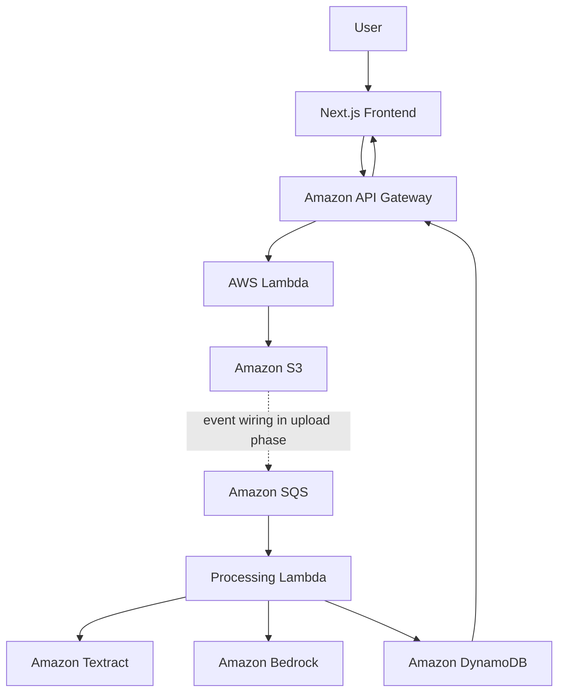

# AI Document Analyzer

A portfolio-quality full-stack application for uploading documents, extracting text with Amazon Textract, and generating structured analysis with Amazon Bedrock.

## Phase 3 Status

The repository foundation, frontend shell, and initial AWS infrastructure are ready. AWS resources are defined with CDK and can be synthesized or deployed from the command line. Textract, Bedrock, Cognito, and document upload APIs are intentionally reserved for later phases.

## Architecture



## Repository Layout

- `frontend/`: Next.js App Router application and user interface.
- `backend/`: TypeScript Lambda handlers, services, repositories, and tests.
- `infrastructure/`: AWS CDK application and infrastructure stacks.
- `shared/`: Types shared across application packages.
- `docs/`: Architecture and project documentation.

## Local Development

Prerequisites: Node.js 22.13+ and npm 10+.

```bash
npm install
npm run dev:frontend
```

Open http://localhost:3000 to view the frontend.

### Authentication

Phase 4 adds a Cognito user pool and protects the API health route with a Cognito authorizer.
Deploy the infrastructure first, then copy the `UserPoolId`, `UserPoolClientId`, and `CognitoRegion`
outputs into `frontend/.env.local` using `frontend/.env.example` as a template:

```bash
npm run cdk -- deploy --all
cp frontend/.env.example frontend/.env.local
npm run dev:frontend
```

The browser client is a public Cognito app client with no secret. New users confirm their email
before signing in. The API expects a Cognito access token in the `Authorization: Bearer <token>` header.

## CDK

Configure AWS credentials using your normal AWS CLI profile or environment. Verify the active identity:

```bash
aws sts get-caller-identity
```

If the account and region have not been prepared for CDK, bootstrap once:

```bash
npx cdk bootstrap
```

Build and inspect the infrastructure without deploying:

```bash
npm run typecheck
npm run cdk -- synth
npm run cdk -- diff
```

When ready, deploy all four stacks:

```bash
npm run cdk -- deploy --all
```

## CI/CD Pipeline

GitHub Actions is defined in [.github/workflows/main.yaml](.github/workflows/main.yaml). Pull requests run type
checks, tests, and the frontend build. Pushes to `main` run those checks and deploy all CDK stacks.

Before enabling deployments, configure these GitHub repository settings:

- Repository variable `AWS_REGION`, such as `us-east-1`.
- Repository secret `AWS_DEPLOY_ROLE_ARN`, containing an AWS IAM role trusted by GitHub's OIDC
  provider for this repository and branch.

The workflow uses short-lived OIDC credentials and does not store AWS access keys in GitHub.
The deployment role should be scoped to the CDK stacks and bootstrap resources used by this project.

The stack creates a private encrypted S3 bucket, encrypted on-demand DynamoDB table, encrypted SQS processing queue and DLQ, two Lambda functions, and a regional API Gateway with `GET /api/health`. The S3-to-SQS event notification is deliberately deferred until the document upload phase, when its producer and message contract are implemented.

## Checks

```bash
npm test
npm run typecheck
npm run lint
npm run format:check
```

Infrastructure tests use CDK assertions and do not require an AWS deployment.

## Environment Variables

Copy `.env.example` to `.env.local` for local frontend configuration and provide deployment values through your environment or a managed secret store. Never commit credentials or local environment files.

## Security Direction

Cognito will own user credentials. Protected API routes will verify Cognito JWT claims, S3 will remain private, and document access will be scoped by authenticated user identity.

## Next: Phase 4

Implement Cognito authentication: user pool configuration, sign-up/sign-in flows, JWT verification at API Gateway/Lambda boundaries, protected frontend routes, and the authenticated user identity contract needed by document uploads.

## Future Improvements

DOCX support, batch processing, document comparison, AI question answering, cross-document search, vector embeddings, Amazon OpenSearch, notifications, CloudFront, and GitHub Actions CI/CD with AWS OIDC.
