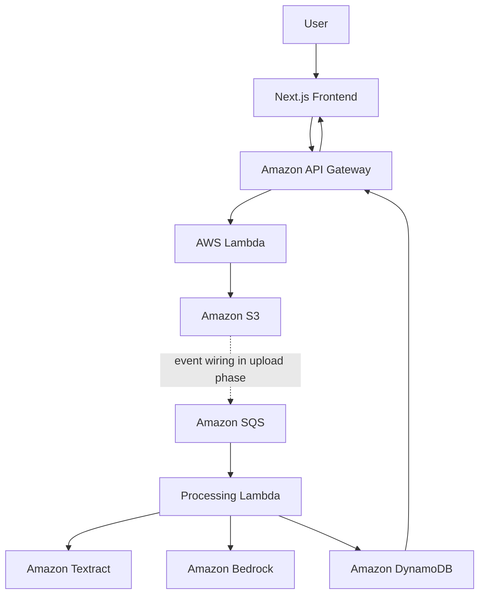

# AI Document Analyzer

A portfolio-quality full-stack application for uploading documents, extracting text with Amazon Textract, and generating structured analysis with Amazon Bedrock.

## Phase 3 Status

The repository foundation, frontend shell, and initial AWS infrastructure are ready. AWS resources are defined with CDK and can be synthesized or deployed from the command line. Textract, Bedrock, Cognito, and document upload APIs are intentionally reserved for later phases.

## Architecture



## Repository Layout

- `frontend/`: Next.js App Router application and user interface.
- `backend/`: TypeScript Lambda handlers, services, repositories, and tests.
- `infrastructure/`: AWS CDK application and infrastructure stacks.
- `shared/`: Types shared across application packages.
- `docs/`: Architecture and project documentation.

## Local Development

Prerequisites: Node.js 22.13+ and npm 10+.

Install all workspace dependencies from the repository root:

```bash
npm install
```

### Frontend

Start the Next.js development server from the repository root:

```bash
npm run dev:frontend
```

Open http://localhost:3000 to view the frontend. The frontend reads Cognito settings from
`frontend/.env.local`; create it from `frontend/.env.example` after the AWS deployment.

### Backend

The backend is implemented as AWS Lambda handlers, so it does not run as a local HTTP server.
Use these commands from the repository root to build and test it locally:

```bash
npm --workspace backend run build
npm --workspace backend test
```

For local end-to-end development, run the frontend locally while the backend runs in AWS:

```bash
npm run deploy
```

The deployment prints the API Gateway URL. The deployed API is protected by Cognito and requires
an access token in the `Authorization: Bearer <token>` header. The current backend only exposes
the health handler; document upload and processing endpoints will be added in later phases.

### Authentication

Phase 4 adds a Cognito user pool and protects the API health route with a Cognito authorizer.
Deploy the infrastructure first, then copy the `UserPoolId`, `UserPoolClientId`, and `CognitoRegion`
outputs into `frontend/.env.local` using `frontend/.env.example` as a template:

```bash
npm run deploy
npm run dev:frontend
```

On Windows PowerShell, use this instead of `cp` when creating the environment file:

```powershell
Copy-Item frontend/.env.example frontend/.env.local
```

The browser client is a public Cognito app client with no secret. New users confirm their email
before signing in. The API expects a Cognito access token in the `Authorization: Bearer <token>` header.

### Google Sign-In

Google sign-in is optional and is enabled during CDK synthesis when both environment variables
are present. In Google Cloud Console, create a Web OAuth client and add this authorized redirect URI:

```text
https://COGNITO_DOMAIN/oauth2/idpresponse
```

Deploy with the Google credentials supplied only to the local process or CI secret store. Set both
variables in the same PowerShell session that runs CDK; values in `frontend/.env.local` are not read
by the CDK app:

```powershell
$env:GOOGLE_CLIENT_ID = '718759290305-gvs5mvsjob52gus8umgd739ecstvijc7.apps.googleusercontent.com'
$env:GOOGLE_CLIENT_SECRET = 'your-google-client-secret'
npm run deploy
```

The current Google client ID is configured in the local environment file. The client secret must
still be supplied in the terminal or as the GitHub Actions secret `GOOGLE_CLIENT_SECRET`.

After deployment, copy the resulting `CognitoDomain` output into `NEXT_PUBLIC_COGNITO_DOMAIN` in
`frontend/.env.local`, then restart the frontend. Register `http://localhost:3000/` as an
authorized JavaScript origin and callback URL in the Cognito app client configuration.

## CDK

Configure AWS credentials using your normal AWS CLI profile or environment. Verify the active identity:

```bash
aws sts get-caller-identity
```

If the account and region have not been prepared for CDK, bootstrap once:

```bash
npx cdk bootstrap
```

Build and inspect the infrastructure without deploying:

```bash
npm run typecheck
npm run cdk -- synth
npm run cdk -- diff
```

When ready, deploy all four stacks:

```bash
  npm run deploy
```

## CI/CD Pipeline

GitHub Actions is defined in [.github/workflows/main.yaml](.github/workflows/main.yaml). Pull requests run backend
and infrastructure type checks, backend compilation, backend and infrastructure tests, CDK synthesis, and the
frontend build. Pushes to `main` or `master` run those checks and deploy all CDK stacks.

Before enabling deployments, configure these GitHub repository settings:

- Repository variable `AWS_REGION`, such as `us-east-1`.
- Repository secret `AWS_DEPLOY_ROLE_ARN`, containing a dedicated AWS IAM role trusted by GitHub's
  OIDC provider for `pregunath/AI-Document-Analyzer`.

The workflow uses short-lived OIDC credentials and does not store AWS access keys in GitHub.
The deployment role should be scoped to the CDK stacks and bootstrap resources used by this project.
If Google sign-in is enabled, add `GOOGLE_CLIENT_ID` and `GOOGLE_CLIENT_SECRET` as GitHub repository
secrets so automated deployments preserve the provider configuration.

### GitHub OIDC AWS Setup

In IAM, add the GitHub OIDC identity provider with URL
`https://token.actions.githubusercontent.com` and audience `sts.amazonaws.com`. Create a dedicated
deployment role with this trust policy, replacing the account ID if deploying elsewhere:

```json
{
  "Version": "2012-10-17",
  "Statement": [
    {
      "Effect": "Allow",
      "Principal": {
        "Federated": "arn:aws:iam::171022098710:oidc-provider/token.actions.githubusercontent.com"
      },
      "Action": "sts:AssumeRoleWithWebIdentity",
      "Condition": {
        "StringEquals": {
          "token.actions.githubusercontent.com:aud": "sts.amazonaws.com"
        },
        "StringLike": {
          "token.actions.githubusercontent.com:sub": [
            "repo:pregunath@88980392/AI-Document-Analyzer@1348686537:ref:refs/heads/master",
            "repo:pregunath/AI-Document-Analyzer:ref:refs/heads/master"
          ]
        }
      }
    }
  ]
}
```

Put the resulting role ARN in `AWS_DEPLOY_ROLE_ARN`. Do not use the CDK bootstrap deploy role
directly; its trust policy is for the AWS account, not GitHub. Grant the dedicated role the
least-privilege permissions required by `cdk deploy --all` before using it for production.

The stack creates a private encrypted S3 bucket, encrypted on-demand DynamoDB table, encrypted SQS processing queue and DLQ, two Lambda functions, and a regional API Gateway with `GET /api/health`. The S3-to-SQS event notification is deliberately deferred until the document upload phase, when its producer and message contract are implemented.

## Checks

```bash
npm test
npm run typecheck
npm run lint
npm run format:check
```

Infrastructure tests use CDK assertions and do not require an AWS deployment.

## Environment Variables

Copy `.env.example` to `.env.local` for local frontend configuration and provide deployment values through your environment or a managed secret store. Never commit credentials or local environment files.

## Security Direction

Cognito will own user credentials. Protected API routes will verify Cognito JWT claims, S3 will remain private, and document access will be scoped by authenticated user identity.

## Next: Phase 4

Implement Cognito authentication: user pool configuration, sign-up/sign-in flows, JWT verification at API Gateway/Lambda boundaries, protected frontend routes, and the authenticated user identity contract needed by document uploads.

## Future Improvements

DOCX support, batch processing, document comparison, AI question answering, cross-document search, vector embeddings, Amazon OpenSearch, notifications, CloudFront, and GitHub Actions CI/CD with AWS OIDC.
